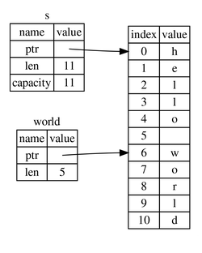

# What is Ownership?
## Ownership in general words
- Ownership is Rust's most unique feature and has deep implications for the rest of the language. It enables Rust to make memory safety guarantees without needing a garbage collector.
- *Ownership* is a set of rules that governs how a Rust program manages memory. If any of the rules are violated, the program won't compile.
- Main purpose of ownership is to manage heap data.

## The Stack and the Heap
- They are parts of memory available at runtime.
- Stack does *lifo*. All data stored on the stack must have a known, fixed size.
- The heap is less organized: The memory allocator finds an empty spot in the heap, marks it, returns a *pointer*, the address of that location. This process is called *allocating*.
- Pushing to the stack is faster than allocating on the heap. Accessing data in the heap is slower.

## Three Ownership Rules
- Each value in Rust has a variable that's called its *owner*.
- There can only be one owner at a time.
- When the owner goes out of scope, the value will be dropped.

## String
- Trying to change a mutable `String` into a string literal gives the error `` expected struct `String`, found `&str` ``.
- A `String` is made up of three parts: a pointer to the memory that holds the contents of the string, a length, and a capacity. This group of data is stored on the stack.
- `String` type is **not** on the heap, it is a fixed size struct and lives on stack unless you box it. What is at heap is the *str*, which is the object *String* stores a pointer to. 

## Memory and Allocation
- There are two jobs for the data on the heap: The memory must be requested from the memory allocator at runtime, and this memory must be returned to the allocator when we're done.
- When a variable goes out of scope, Rust calls a special function called `drop`.
- Copying a `String` sounds like *shallow copy*, but because Rust also invalidates the first variable, it's known as *move*.
- There are two important traits related here: `Drop` and `Copy`. Basically, only simple scalar values can implement `Copy`. Any type implementing `Drop` can't be `Copy`.

## Functions
- The semantics for passing a value to a function are similar to those for assigning a value to a variable.
- Returning values can also transfer ownership.
- The macros, e.g. `println!`, implicitly take a reference to any arguments to be formatted.

# References and Borrowing
- A *reference* is like a pointer in that it’s an address we can follow to access data stored at that address that is owned by some other variable. Unlike a pointer, a reference is guaranteed to point to a valid value of a particular type.
- The `&var` syntax lets us create a reference that refers to the value of `var` but does not own it.
- We call the action of creating a reference *borrowing*.
- Just as variables are immutable by default, so are references.
- Given a reference to some data, the compiler will ensure that the data will not go out of scope before the reference to the data does.

## The Rules of References
- At any given time, you can have *either* one mutable reference *or* any number of immutable references.
- References must always be valid.

# The Slice Type
- *Slices* let you reference a contiguous sequence of elements in a collection rather than the whole collection. A slice is a kind of reference, so it does not have ownership.
- A *string slice* is a reference to part of a `String`.
- Internally, the slice data structure stores the starting position and the length of the slice.

| 
|:--:| 
| Figure 4-6 from the book: String slice referring to part of a `String`|

- `str` is an immutable sequence of UTF-8 bytes of dynamic length somewhere in memory. Since the size is unknown, one can only handle it behind a pointer. This means that `str` most commonly appears as `&str`.
