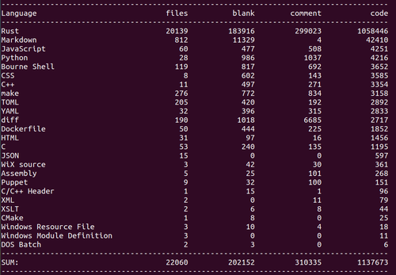

# Wikipedia
- First appearing in 2010, Rust was designed by Graydon Hoare at Mozilla Research.
- Rust's major influences include C++, OCaml, Haskell, and Erlang.
- Used by companies including Amazon, Discord, Dropbox, Facebook (Meta), Google (Alphabet), and Microsoft.
- Rust has been voted the "most loved programming language" in the Stack Overflow Developer Survey every year since 2016, and was used by 7% of the respondents in 2021.

# Github

- [Trending Rust repos and devs on GitHub](https://github.com/trending/rust)
- [Awesome Rust](https://github.com/rust-unofficial/awesome-rust) - A curated list of Rust code and resources, 24k Star

# Miscellaneous

| 
|:--:| 
| *[cloc](https://github.com/AlDanial/cloc) output of the main repository, [rust-lang/rust](https://github.com/rust-lang/rust)* |

